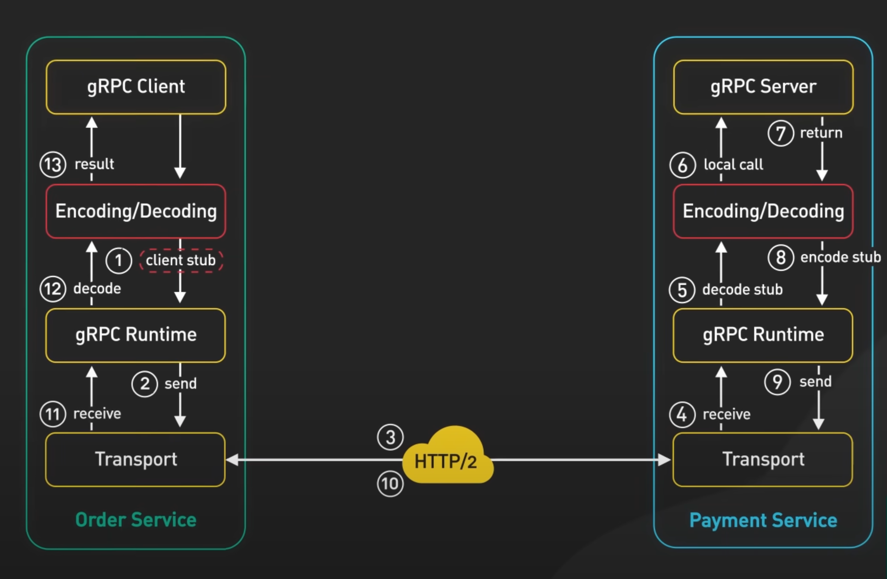

# gRPC
Experimenting/learning with gRPC

# Install
```
// https://grpc.io/docs/languages/go/quickstart/

brew install protobuf


go install google.golang.org/protobuf/cmd/protoc-gen-go@latest
go install google.golang.org/grpc/cmd/protoc-gen-go-grpc@latest
export PATH="$PATH:$(go env GOPATH)/bin"
```

# How to use protoc
```
protoc --go_out=. --go-grpc_out=. path/to/your/file.proto
```

# How to

1. First write your gRPC service
    * Write your contract (what your service does?)
    * Request entity
    * Response entity
2. Generate RPC code for your RPC service using protoc. This should generate 2 files
    * _grpc.pb.go
    * .pb.go
    * This will generate : 
        1. NewGreeterClient implementing the service Greeter
        2. Server: Mapping of your methods to the handlers that will do the work
3. Write your server code     
    1. Take dependency of the gRPC service
    2. Start your gRPC service
        1. Listen on a port
        2. Start a new gRPC server
        3. Register your service with the gRPC server 
        4. Start listening on the port on step #1 with the server on step #2
```go
  net.Listen("tcp", ...)   
  s := grpc.NewServer()
  pb.RegisterGreeterServer(s, &server{})
  s.Serve(lis)
```  
    3. Implement the Service and can invoke the server method.
4. Write your client code 
    1. Start a new connection using grpc.NewClient(....) with the server running
    2. Take dependency of the gRPC service. Call that to initiate a new client.

# gRPC
* gRPC as a preferred implementation of RPC.
* Protocol buffers as data interchange format (as the encoding format)
    1. strongly typed  
    2. Specify required/optional field 
    3. Above 2 benefits vs JSON messages with key-value pairs that aren't checked until you get to the receiving end.
    4. Specify procedures you expect to expose
    5. Specify language for communication
* High performant (efficient binary encoding format)    
* Built on top of HTTP/2 to provide high perf foundation at scale.
    * Multiplexing
    * Strean prioritization
    * Binary protocol
    * Server push
    * Allows multiple streams of messages over a single long lived TCP connection
    * gRPC is 5 times faster than JSON
* Requires low level access to http/2 primitives (No browsers support it yet)

# Flow
* Screen grabbed from bytebytego youtube video



# 3 types of gRPC connection
1. insecure
2. server side TLS - only server provides its certificate to client. Basically server does not care who is calling.
3. mTLS - both client/server needs to be provide certs. 

# gRPC modes
1. Unary RPC (Req -> resp. Client sync waits)
2. Server streaming RPC (exactly like websockets)
3. Client streaming RPC (upload)
4. Bidirectional (chatting)

# gRPC deep dive

* Natively implemented in 3 langauges - Java, Go and C. Other languages call C (gRPC-C-Core)
* protobuf support are provided by language wrappers (not core).
* Core stack is very lean. 
* Most of the features are provided by pluggable filters.
    - Auth, Tracing, name/service resolution, LB, compression, message size checks, RPC deadlines, etc
* Works with many transports
    - By default, uses HTTP2 transport
    - Other implementations: QUIC, Cronet, inprocess and more. 
* Designed for performance


 
* Client <=Channel=> Target
* Channel is a collection of subchannels. Subchannel maps to a connection. 
* A call is bound to a channel. Multiple calls can share the same Channel.
* Operations
  * Send/receive initial/trailing metadata (Exactly once)
  * Send/Receive message (Zero or more by Client and Server)
* Client and server perform operation in batches.
* When a batch is finished, this event is notified via a completion queue.


# Long lived RPCs
* RPCs that last minutes, hours and days
* Watches/Notifications (Reduce polling, reduced latency, Hanging "GET")
* Load balancing decisions are made per RPC and they mostly stay lifetime.
* MAX_CONNECTION_AGE can accumulate connections.
* Issues to live with: Network failures.
* Load balancing: Have server occasionally close RPC (MAX_CONNECTION_AGE + MAX_CONNECTION_AGE_GRACE)
* writes are not acked
